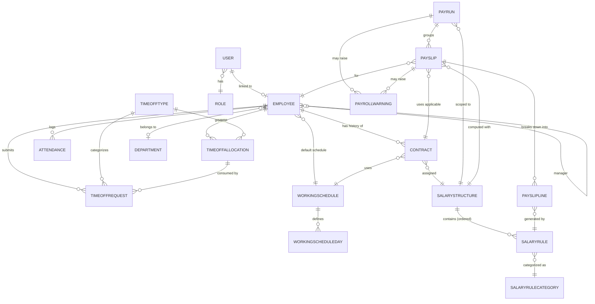

# 05 — Entity Relationship Diagram

## Relationship Explanations

- **USER ↔ EMPLOYEE**: A `User` is an authentication account and is optionally (per `[TEAM DECISION REQUIRED]`) linked to exactly one `Employee` HR record. They are distinct concepts — see `02_FEATURE_SPEC.md` (Flow 0). Not every Employee necessarily has a login account, and User management is Admin-controlled.
- **USER ↔ ROLE**: Each `User` has exactly one `Role`, which drives all RBAC decisions per `03_USER_ROLES_RBAC.md`.
- **EMPLOYEE ↔ CONTRACT**: One-to-many. An employee accumulates a full history of contracts over time; none are deleted. Payroll always resolves the single contract applicable to a given period (BR-CON-001), not simply the latest one.
- **EMPLOYEE ↔ ATTENDANCE**: One-to-many. Every check-in/check-out entry belongs to exactly one employee.
- **EMPLOYEE ↔ TIMEOFFREQUEST / TIMEOFFALLOCATION**: One-to-many each. An employee can have many leave requests and many allocations (one per Time Off Type typically).
- **EMPLOYEE ↔ WORKINGSCHEDULE**: An employee has a default assigned schedule; a Contract may also carry its own schedule reference (used preferentially for payroll period calculations where present).
- **EMPLOYEE ↔ DEPARTMENT / EMPLOYEE ↔ EMPLOYEE (manager)**: Standard org-structure references.
- **CONTRACT ↔ WORKINGSCHEDULE / SALARYSTRUCTURE**: Each Contract pins down the specific schedule and salary structure that apply for its own date range, allowing different structures/schedules across an employee's contract history.
- **WORKINGSCHEDULE ↔ WORKINGSCHEDULEDAY**: One-to-many; the weekly pattern (per weekday Start/End/Break) that the schedule's `weekly_hours` is computed from.
- **TIMEOFFTYPE ↔ TIMEOFFALLOCATION / TIMEOFFREQUEST**: A Time Off Type defines the policy; Allocations and Requests both reference it to inherit its rules (unit, approval requirement, allocation requirement).
- **TIMEOFFALLOCATION ↔ TIMEOFFREQUEST**: An approved Request that requires allocation links to and decrements the relevant Allocation's remaining balance.
- **SALARYSTRUCTURE ↔ SALARYRULE**: One-to-many, ordered by `sequence`. A structure is nothing more than an ordered container of rules.
- **SALARYRULE ↔ SALARYRULECATEGORY**: Each rule is tagged with a category (Basic/Allowances/Gross/Deductions/Net) used for payslip grouping and dashboard aggregation.
- **PAYRUN ↔ SALARYSTRUCTURE**: A Payrun is scoped to exactly one Salary Structure (chosen in Step 1 of the creation wizard); this determines which rules apply to every Payslip inside it.
- **PAYRUN ↔ PAYSLIP**: One-to-many. A Payrun batches many employees' Payslips for one period.
- **PAYSLIP ↔ CONTRACT**: Each Payslip stores which specific Contract was determined applicable for its period — critical for auditability when contracts change mid-history.
- **PAYSLIP ↔ PAYSLIPLINE ↔ SALARYRULE**: A Payslip's lines are the materialized, computed output of running each of the structure's Salary Rules in sequence for that employee/period.
- **PAYRUN/PAYSLIP ↔ PAYROLLWARNING**: Either a whole Payrun or an individual Payslip may accumulate warnings (missing bank details, duplicate payslip, contract issues) that must be surfaced before finalization.
