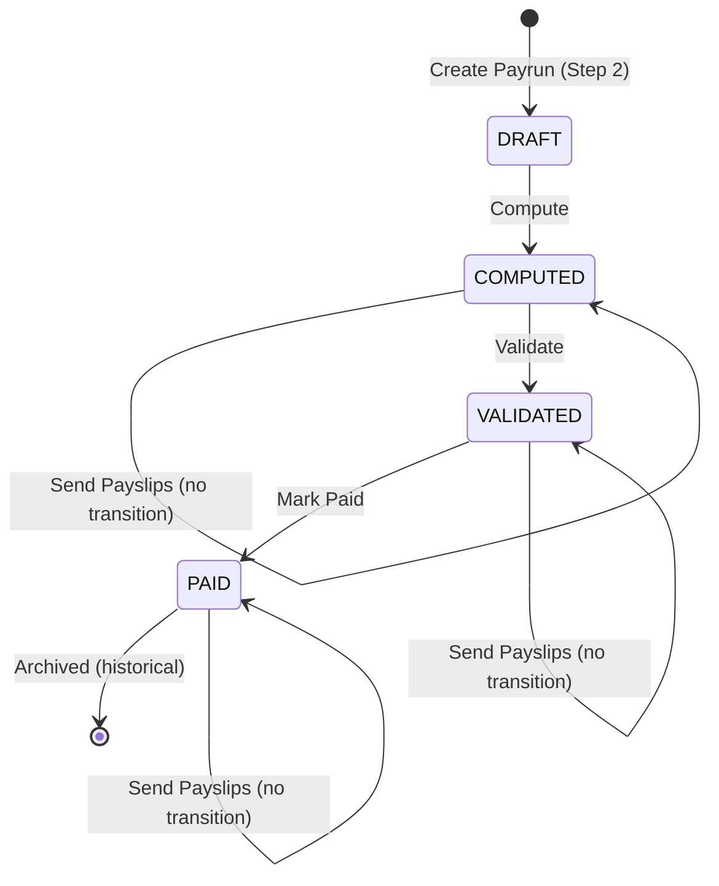

# 08 — Payrun State Machine

`[OFFICIAL REQUIREMENT]`

## States

- `DRAFT` — created via wizard Step 2 "Create Payrun"; contains selected employee scope but no computed payslips.
- `COMPUTED` — Compute action has run; Payslips and their lines exist; warnings may be present.
- `VALIDATED` — Validate action has run; officer has reviewed computed data and warnings.
- `PAID` — Mark Paid action has run; batch is finalized and archived as historical record.

## Actions

| Action | Valid from state | Resulting state | Side effects |
|---|---|---|---|
| Compute | DRAFT, COMPUTED (recompute) | COMPUTED | Runs the payroll engine (`07_PAYROLL_ENGINE.md`) for every employee in scope; creates/updates Payslips, PayslipLines, PayrollWarnings |
| Validate | COMPUTED | VALIDATED | Marks the batch reviewed; `[TEAM DECISION REQUIRED]` whether unresolved blocking warnings prevent this transition |
| Mark Paid | VALIDATED | PAID | Marks all Payslips as Paid; batch becomes historical/immutable |
| Send Payslips | COMPUTED, VALIDATED, or PAID (`[TEAM DECISION REQUIRED]` on earliest allowed state) | No state change | Triggers bulk email of Payslip PDFs |

## Mermaid State Diagram

## Forbidden Transitions

- DRAFT → VALIDATED (must Compute first)
- DRAFT → PAID (must Compute and Validate first)
- COMPUTED → PAID (must Validate first)
- Any transition backward (PAID → VALIDATED, VALIDATED → COMPUTED, etc.) is not defined by the source and must be treated as forbidden unless a team decision explicitly adds a rollback path.

## Validation Requirements Before Transition

| Transition | Requirement |
|---|---|
| → COMPUTED | Payrun must have at least one selected employee (from wizard Step 2) |
| → VALIDATED | Payslips must exist for the Payrun; blocking-warning policy per `[TEAM DECISION REQUIRED]` |
| → PAID | Payrun must be VALIDATED; `[TEAM DECISION REQUIRED]` whether payment-registration details (e.g., bank confirmation) are required first |

## Side Effects

- **Compute**: creates/overwrites Payslip + PayslipLine rows; recomputation should be idempotent for unchanged inputs (deterministic per `07_PAYROLL_ENGINE.md`).
- **Mark Paid**: Payslip-level status also updates to Paid; per `15_AI_RULES.md` #19, Payslip data becomes immutable after this point unless explicitly supported otherwise.

## Rollback Behavior

Not specified in the source. `[TEAM DECISION REQUIRED]` — e.g., whether a VALIDATED Payrun can be reverted to COMPUTED to fix a data issue before Mark Paid.

## Historical Preservation

`[OFFICIAL REQUIREMENT]` "Finalized Payruns are archived for history." A PAID Payrun and its Payslips must remain permanently queryable (for the Dashboard and audit) and must not be deleted or overwritten by later operations.
