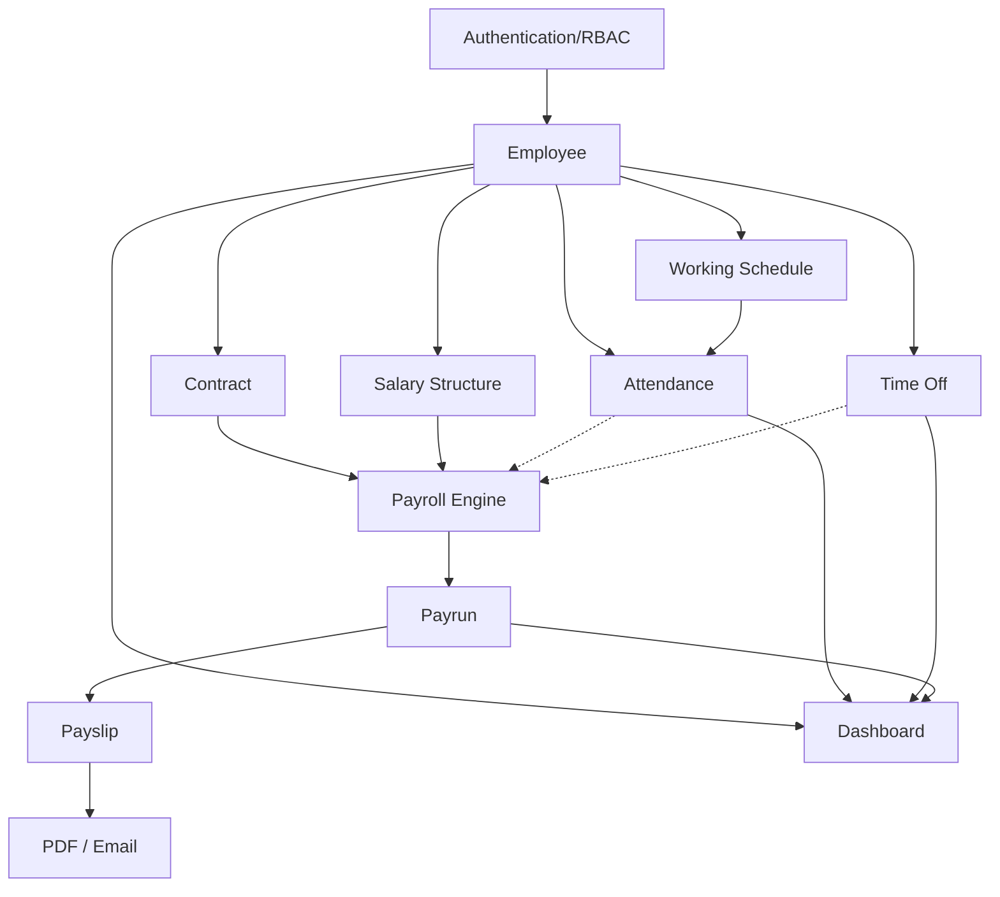

# 19 — Development Plan & Presentation Strategy

## 1. Executive Summary
This document provides the final execution and presentation strategy for the PeoplePay360 HR & Payroll Hackathon project. The plan assigns functional ownership to a 4-person team to maximize parallel development over 24 hours while preventing AI agent code conflicts. It covers module boundaries, dependencies, critical paths, risk mitigation, and a judge-facing presentation strategy focused on business logic, integration, and data relationships.

## 2. Team Structure
- **Person 1**: Core HR + Authentication
- **Person 2**: Attendance + Time Off
- **Person 3**: Payroll Engine
- **Person 4**: Frontend + Dashboard + Integration

---

## 3. Person 1 — Core HR + Authentication
**A. Role**: Foundation & Identity Lead
**B. Module ownership**: Authentication, User Management, Employees, Contracts, Working Schedules
**C. Features**: Login, User accounts, User → Employee relationship, Role assignment, Authorization, Employee CRUD, Kanban/List/Form views, Contracts history, Applicable contract selection, Working Schedule calculation
**D. Entities owned**: User, Role, Department, Employee, Contract, WorkingSchedule, WorkingScheduleDay
**E. APIs owned**: `/api/v1/auth/*`, `/api/v1/users/*`, `/api/v1/employees/*`, `/api/v1/contracts/*`, `/api/v1/schedules/*`
**F. UI screens owned**: Login, User Management, Employee Kanban/List/Form, Contract List/Form, Working Schedule List/Form
**G. Business rules implemented**: BR-AUTH-001, BR-AUTH-002, BR-EMP-001, BR-CON-001, BR-CON-002, BR-SCH-001
**H. Tests required**: TC-AUTH-*, TC-RBAC-*, TC-EMP-*, TC-CON-*, TC-SCH-*
**I. Dependencies**: None (upstream).
**J. Collaborators**: Person 2 (Attendance depends on Schedule), Person 3 (Payroll depends on Employee & Contract), Person 4 (UI Integration).
**K. Files/modules they may modify**: `auth/*`, `users/*`, `rbac/*`, `employees/*`, `contracts/*`, `schedules/*`
**L. Files/modules they must not modify**: `attendance/*`, `time-off/*`, `payroll-engine/*`, `frontend/*`, `dashboard/*`
**M. Definition of Done**: Database/API/Auth/Validations implemented, working schedule auto-calculation functioning, period-based contract resolution service working, happy/edge paths tested.
**N. Integration checkpoints**: Checkpoints 1, 2, 5
**O. Demo contribution**: Login/RBAC demo, Employee Hub & Contract history visualization (Scenario 1).
**P. Judge explanation**: "I worked on the HR foundation and Identity. The purpose of this module is to establish the Employee as the central hub of our system, distinct from user authentication. The important business logic is how we handle contracts and schedules. For example, instead of just using the latest contract, the system preserves history and programmatically selects the contract that applies to a specific payroll period. This matters because it ensures absolute accuracy for historical payroll runs even as employee terms change over time."
**Q. Likely judge questions**: 
- "How do you handle multiple contracts?"
- "How do you prevent employees from accessing payroll?"
**R. Suggested answers**: 
- *Multiple Contracts*: "We preserve the full contract history. Our service compares the target payroll period against the start and end dates of all contracts to select the applicable one. If it detects overlapping active contracts, it surfaces a validation warning (BR-CON-002)."
- *RBAC*: "Authentication is separate from HR data. We use a strictly enforced backend RBAC middleware. Even if a user tries to access a payroll route, the backend independently verifies their role, returning a 403 Forbidden."

---

## 4. Person 2 — Attendance + Time Off
**A. Role**: Operations & Leave Logic Lead
**B. Module ownership**: Attendance, Time Off Types, Allocations, Requests
**C. Features**: Attendance Check-in/out, Worked hours computation, Exception flagging, Authorized corrections, Time Off Types, Allocations, Leave Requests, Approval workflow, Balance calculation
**D. Entities owned**: Attendance, TimeOffType, TimeOffAllocation, TimeOffRequest
**E. APIs owned**: `/api/v1/attendance/*`, `/api/v1/time-off-types/*`, `/api/v1/allocations/*`, `/api/v1/time-off-requests/*`
**F. UI screens owned**: Attendance List/Form/Widget, Time Off Requests List/Form, Allocations List/Form, Time Off Types List/Form
**G. Business rules implemented**: BR-ATT-001, BR-ATT-002, BR-LEAVE-001, BR-LEAVE-002, BR-LEAVE-003
**H. Tests required**: TC-ATT-*, TC-LEAVE-*
**I. Dependencies**: Employee, Working Schedule, RBAC Guard (from Person 1)
**J. Collaborators**: Person 1 (Employee context), Person 3 (Approved leave for payroll context), Person 4 (UI Integration).
**K. Files/modules they may modify**: `attendance/*`, `time-off/*`
**L. Files/modules they must not modify**: Core HR modules, Payroll Engine, Frontend shell.
**M. Definition of Done**: Check-in/out logic handles worked hours calculation, approval strictly consumes leave balance, validations (negative balance) enforced, integrated and tested.
**N. Integration checkpoints**: Checkpoint 3, 8
**O. Demo contribution**: Attendance exceptions and the complete Leave Allocation → Request → Approval → Balance deduction flow (Scenario 2).
**P. Judge explanation**: "I worked on Attendance and Time Off. The purpose of this module is to capture day-to-day operational activity and connect leave policies with actual employee requests. The important business logic is how we enforce balance integrity and exception handling. For example, leave balances are only consumed when a request is explicitly approved by a manager, and any attempt to approve a request that exceeds the allocation is blocked at the database level. This matters because it transforms our system from a simple data store into an operational tool."
**Q. Likely judge questions**: 
- "How do you calculate worked hours?"
- "What happens if a leave request is refused?"
**R. Suggested answers**: 
- *Worked Hours*: "We compute worked hours based on check-in and check-out timestamps and compare them against the expected working schedule from Person 1's module to flag exceptions."
- *Leave Refusal*: "If a request is refused, it has zero impact on the Allocation balance. The balance is only deducted atomically upon transition to the 'Approved' state (BR-LEAVE-003)."

---

## 5. Person 3 — Payroll Engine
**A. Role**: Payroll & Computation Lead
**B. Module ownership**: Salary Structures, Salary Rules, Payroll Engine, Payruns, Payslips, PDF, Bulk Email
**C. Features**: Rule sequencing, Payroll computation, Applicable contract usage, Payrun state machine, Payslip generation, Validation warnings, PDF generation, Email
**D. Entities owned**: SalaryStructure, SalaryRuleCategory, SalaryRule, Payrun, Payslip, PayslipLine, PayrollWarning
**E. APIs owned**: `/api/v1/salary-structures/*`, `/api/v1/salary-rules/*`, `/api/v1/payruns/*`, `/api/v1/payslips/*`
**F. UI screens owned**: Payrun Wizard, Payrun Processing, Payslip Detail, Salary Structures/Rules Detail
**G. Business rules implemented**: BR-PAY-001, BR-PAY-002, BR-PAY-003, BR-RULE-001, BR-PSL-001, BR-PSL-002, BR-PSL-003
**H. Tests required**: TC-RULE-*, TC-ENGINE-*, TC-PAY-*, TC-PSL-*, TC-PDF-*, TC-EMAIL-*
**I. Dependencies**: Contract Resolution & Employee (Person 1), Attendance/Leave (Person 2)
**J. Collaborators**: Person 1, Person 2, Person 4
**K. Files/modules they may modify**: `salary-structures/*`, `salary-rules/*`, `payroll-engine/*`, `payruns/*`, `payslips/*`, `pdf/*`, `email/*`
**L. Files/modules they must not modify**: `employees/*`, `contracts/*`, `attendance/*`, `time-off/*`, `frontend/*`
**M. Definition of Done**: Payroll engine deterministically calculates payslips based on sequenced rules, valid transitions enforced, duplicate payslips detected, PDFs generate correctly.
**N. Integration checkpoints**: Checkpoint 4, 5, 6, 7
**O. Demo contribution**: Computing the payrun, surfacing missing contract warnings, validating payslips, and generating the PDF (Scenario 1).
**P. Judge explanation**: "I worked on the Payroll Engine. The purpose of this module is to transform HR data into a verified financial result. The important business logic is our configurable, sequence-based calculation engine. For example, instead of hardcoding payroll, we combine the period-specific Contract, the assigned Salary Structure, and its ordered Salary Rules to generate deterministic Payslips. The system automatically detects duplicate payslips and missing contracts. This matters because it provides the flexibility of a real enterprise system while ensuring absolute financial integrity."
**Q. Likely judge questions**: 
- "How are salary rules executed?"
- "How do you detect duplicate payslips?"
- "How do you validate payroll before marking it paid?"
**R. Suggested answers**: 
- *Execution*: "Rules execute sequentially based on their defined order. A rule can use fixed amounts, percentages, or formulas that reference the computed results of earlier rules, like calculating Transport as 10% of Basic."
- *Duplicates*: "We enforce uniqueness at the database level for the combination of employee and payrun. Any attempt to generate a second payslip raises a `duplicate_payslip` warning."
- *Validation*: "Before finalizing a payrun, the engine checks for missing bank details, contract overlap, and other anomalies, surfacing these as warnings on the Payrun Processing screen."

---

## 6. Person 4 — Frontend + Dashboard + Integration
**A. Role**: Integration & Analytics Lead
**B. Module ownership**: Main Navigation, Frontend integration, UI/UX, Dashboard, Demo flow
**C. Features**: Cross-module navigation, API integration, Role-based UI visibility, Dashboard KPIs/Charts, Live filtering, Loading/Error states
**D. Entities owned**: None (Reads across all modules)
**E. APIs owned**: `/api/v1/dashboard`
**F. UI screens owned**: Dashboard, Global Layout/Navigation, wiring of all 30 screens.
**G. Business rules implemented**: BR-DASH-001
**H. Tests required**: TC-DASH-*, TC-INT-*, TC-E2E-*
**I. Dependencies**: All API endpoints from Persons 1, 2, and 3.
**J. Collaborators**: Person 1, Person 2, Person 3
**K. Files/modules they may modify**: `frontend/*`, `dashboard/*`
**L. Files/modules they must not modify**: Backend business logic services, database schema migrations.
**M. Definition of Done**: All APIs integrated, cross-module navigation smooth, Dashboard fetches and aggregates live data dynamically (no static mocks), demo flows execute perfectly.
**N. Integration checkpoints**: Checkpoint 7, 8, 9
**O. Demo contribution**: Driving the seamless UX, filtering the live dashboard, and demonstrating data aggregation.
**P. Judge explanation**: "I worked on Frontend Integration and the Payroll Dashboard. The purpose of this module is to unify the distinct HR and Payroll components into a single, cohesive experience. The important business logic here is real-time data aggregation. For example, our dashboard doesn't rely on static mock data; every KPI, chart, and alert is computed live from the underlying database across Employees, Attendance, Time Off, and Payroll periods. This matters because it gives leadership instant visibility into payroll costs, attendance health, and pending bottlenecks."
**Q. Likely judge questions**: 
- "How are your modules connected?"
- "Are the dashboard numbers real?"
**R. Suggested answers**: 
- *Connection*: "We strictly separated our backend services but unified them through an API contract. The frontend orchestrates these calls, so the user experiences one system, even though the Payroll Engine and Core HR are decoupled."
- *Live Data*: "Yes, absolutely real. If a manager approves a leave request or a payrun is marked Paid, reloading the dashboard or changing a filter instantly reflects that exact change through live queries."

---

## 7. Shared Ownership
The following artifacts are TEAM-OWNED and cannot be silently changed by one developer or their AI agent:
- `04_DATABASE_SCHEMA.md`
- `05_ER_DIAGRAM.md`
- `03_USER_ROLES_RBAC.md`
- `06_BUSINESS_RULES.md`
- `07_PAYROLL_ENGINE.md`
- `09_API_CONTRACT.md`
- `14_ARCHITECTURE.md`
- `18_DECISIONS.md`

Any required changes to these must be proposed, agreed upon by the team, and recorded in `18_DECISIONS.md`.

## 8. Documentation Access Model
All developers (and their AI agents) have **READ** access to the entire `/instructions` directory to understand the full system context. However, **WRITE** access to application source code is strictly scoped to the developer's assigned functional area.

## 9. AI Agent Scope Model
Each AI agent must be instructed with a strict scope. 
**Prompt Template**:
"You are the AI assistant for Person [X]. You may read all documentation. You may modify ONLY files in [Assigned Directories]. You may not modify [Other Directories] without approval. If a cross-module change is required: STOP. Explain why. Identify the dependency. Request approval. You must never invent business logic, silently change the DB schema, alter API contracts, hardcode data, bypass RBAC, or duplicate existing services."

## 10. Module Dependency Graph

## 11. Critical Path
1. Authentication & RBAC (Blocks everything).
2. Employee & Contract (Blocks Payroll & Attendance).
3. Contract Resolution Service (Blocks Payroll Engine).
4. Payroll Engine (Blocks Payslips & Dashboard financial metrics).
5. Frontend Integration (Blocks the final demo).

## 12. P0/P1/P2 Priority Matrix
**P0 (Must Work for Demo)**:
- Login & Role enforcement
- Employee CRUD
- Contract Resolution (BR-CON-001)
- Attendance Check-in/out
- Leave Request & Approval (Balance deduction)
- Salary Rule execution & sequence
- Payrun Wizard & lifecycle transitions
- PDF Generation
- Live Dashboard KPIs
- Cross-module API integration

**P1 (Important completeness)**:
- Missing/overlapping contract warnings
- Working schedule auto-calculation
- Bulk email (or simulated log)
- Dashboard charts (Cost by Department)
- Attendance exception highlighting

**P2 (Nice to have)**:
- Kanban drag-and-drop
- Advanced data filtering
- Detailed Audit Logging

## 13. 24-Hour Execution Timeline
- **Hours 0-2 (Phase 0)**: Read docs, freeze schema, resolve DEC-001 to DEC-007, generate seed data script.
- **Hours 2-6 (Phase 1)**: Person 1 builds Auth/RBAC/Employee. Person 4 stubs Frontend shell.
- **Hours 6-12 (Phase 2)**: Core parallel implementation. Person 1 (Contracts/Schedules). Person 2 (Attendance/Leave). Person 3 (Salary Structures/Rules).
- **Hours 12-16 (Phase 3)**: Complex logic. Person 3 builds Payroll Engine. Person 2 finishes Approval logic. Person 1 finishes Contract resolution.
- **Hours 16-19 (Phase 4)**: Integration. Person 4 wires real endpoints. Person 3 wires PDF/Payruns.
- **Hours 19-21 (Phase 5)**: End-to-end testing of Demo Scenario 1 and 2.
- **Hours 21-23 (Phase 6)**: Dashboard live integration. Final bug fixes. Demo preparation.
- **Hours 23-24 (Phase 7)**: Code freeze, presentation rehearsal.

## 14. Integration Checkpoints
- **Checkpoint 1 (Hour 4)**: Auth + RBAC + Employee APIs working.
- **Checkpoint 2 (Hour 8)**: Employee + Contract APIs working.
- **Checkpoint 3 (Hour 12)**: Attendance + Time Off APIs working.
- **Checkpoint 4 (Hour 12)**: Salary Structure + Rules APIs working.
- **Checkpoint 5 (Hour 15)**: Payroll Engine integrates with Contract resolution.
- **Checkpoint 6 (Hour 17)**: Payrun lifecycle generates Payslips.
- **Checkpoint 7 (Hour 19)**: End-to-End Scenario 1 (UI to PDF) succeeds.
- **Checkpoint 8 (Hour 20)**: End-to-End Scenario 2 (Leave Approval) succeeds.
- **Checkpoint 9 (Hour 22)**: Dashboard populates with live data.

## 15. Git/Collaboration Rules
- Trunk-based development or short-lived feature branches.
- Merge conflicts resolved by owners of the affected modules.
- Schema migrations must be communicated before merge.

## 16. Definition of Done (General)
Feature is DONE only when:
- Database, API, and UI are integrated.
- Authorization (RBAC) is enforced on the backend.
- Validations and business logic are implemented.
- Happy path and edge cases are tested.
- It functions seamlessly within the demo flow.

## 17. Risk Register
| Risk | Probability | Impact | Owner | Mitigation | Fallback |
|---|---|---|---|---|---|
| AI code conflicts | High | High | All | Strict scoping rules for AI agents. | Manual merge/revert. |
| Payroll engine bugs | Med | Critical | Person 3 | TDD (TC-ENGINE-001), start early. | Fall back to pre-seeded Payrun data for demo. |
| Schema mismatch | High | Med | All | Shared ownership of schema, communicate changes. | Freeze schema at Hour 2. |
| Late integration | High | Critical | Person 4 | Frontend uses stubs early; continuous integration. | Hardcode API responses in UI temporarily if backend blocks. |
| PDF/Email failure | Med | Med | Person 3 | Isolate service. | Pre-generate sample PDF; show server logs for email. |

## 18. AI Failure Prevention
- **Shared Source of Truth**: All AI agents are pointed to `/instructions`.
- **Strict Boundaries**: AI agents are instructed to refuse cross-module edits.
- **Human Oversight**: Complex business logic (Payroll Engine, Balance Deduction, Contract Resolution) must be heavily reviewed and tested by humans, not blindly accepted from AI.

## 19. Individual Judge Explanation Scripts
*(See sections 3.P, 4.P, 5.P, 6.P for individual scripts)*

## 20. Complete Team Presentation Story
"PeoplePay360 connects the entire employee lifecycle with payroll. We start with a centralized employee record. Contracts and working schedules establish payroll and attendance context. Attendance captures daily operational activity, while Time Off manages leave policies, allocations, and approvals. Our custom Payroll Engine uses Salary Structures and configurable Salary Rules to execute deterministic payroll computation. A Payrun selects a period and employees, computes payslips using the correct applicable contract, validates warnings like duplicate payslips, and finalizes payment. Payslips are then generated as PDFs. Finally, our live Dashboard aggregates all this HR, attendance, leave, and payroll data in real-time."

## 21. Five-Minute Demo Script
- **0:00-0:20**: Problem statement & introduction.
- **0:20-0:50**: Login as HR Payroll Manager (RBAC).
- **0:50-1:30**: Employee hub, show Priya Nair's Contract history (Scenario 1 start).
- **1:30-2:20**: Attendance list (show exceptions), Time Off Approval (Scenario 2 - approve leave and show balance deduction).
- **2:20-3:50**: Payrun Wizard. Compute "September 2026 Payroll". Show the missing contract warning for Aditya. Show computed Payslips.
- **3:50-4:20**: Open Devansh's Payslip. Generate PDF. Trigger Bulk Email.
- **4:20-4:50**: Open Dashboard. Show live data aggregation, filter by department.
- **4:50-5:00**: Architecture highlights & Future Roadmap.

## 22. Likely Judge Questions & Answers
- **Business**: "Why is this different from a normal CRUD app?" -> "Because it enforces operational workflow. Payruns use period-aware contract selection, leave requires managerial approval to affect balances, and payroll is driven by a sequenced calculation engine, not manual data entry."
- **Architecture**: "How are your modules connected?" -> "Independent services orchestrated through a strictly defined API layer. The Payroll Engine reads from Core HR, but never mutates HR data."
- **Database**: "Why did you choose these relationships?" -> "To preserve history. Employees have a one-to-many relationship with Contracts so we never lose past wage data, which is essential for payroll audits."
- **Security/RBAC**: "Is authorization enforced only in the frontend?" -> "No, backend is authoritative. The UI hides buttons, but the API independently verifies the user's role and record ownership before taking any action."
- **Scalability**: "What happens when employees grow?" -> "The architecture supports indexing on period searches and handles bulk payroll computation within transactional bounds to ensure integrity."

## 23. AI Usage Explanation
"We used AI as a development accelerator, while the team defined the architecture, data model, business rules, module boundaries, and validation requirements. AI agents were given strict documentation and scoped module ownership to prevent conflicts. Critical business logic, like the payroll calculation engine and leave balance integrity, was thoroughly reviewed and tested by the human team to ensure deterministic correctness."

## 24. Future Roadmap Talking Points
- Full support for country-specific statutory tax implementations.
- Biometric/Geofenced attendance integrations.
- Multi-company and multi-currency payroll scaling.
- Automated holiday calendar integration.
- Employee self-service portals for advanced requests.

## 25. Final MVP Checklist
- [ ] Database Schema Deployed
- [ ] RBAC Middleware Active
- [ ] API Endpoints Functional
- [ ] Frontend UI Wired
- [ ] Business Rules (BR-*) Tested
- [ ] Validation Rules Enforced
- [ ] Seed Data Populated

## 26. Final Demo Readiness Checklist
- [ ] "September 2026 Payroll" exists in Draft.
- [ ] Devansh Rao has a Pending Leave Request.
- [ ] Aditya Verma has no contract (to show warning).
- [ ] Priya Nair has historical + active contracts.
- [ ] "August 2025 Payroll" is Paid (for dashboard stats).
- [ ] All login credentials tested.
- [ ] Fallback PDF ready in case of live generation failure.

## 27. Open Issues / Team Decisions Required
The team MUST resolve the items logged in `/instructions/18_DECISIONS.md` before proceeding. This includes choosing the tech stack (DEC-001), auth mechanism (DEC-002), rounding/formula logic (DEC-006), and exact blocking severity for warnings (DEC-004, DEC-005, DEC-007).
